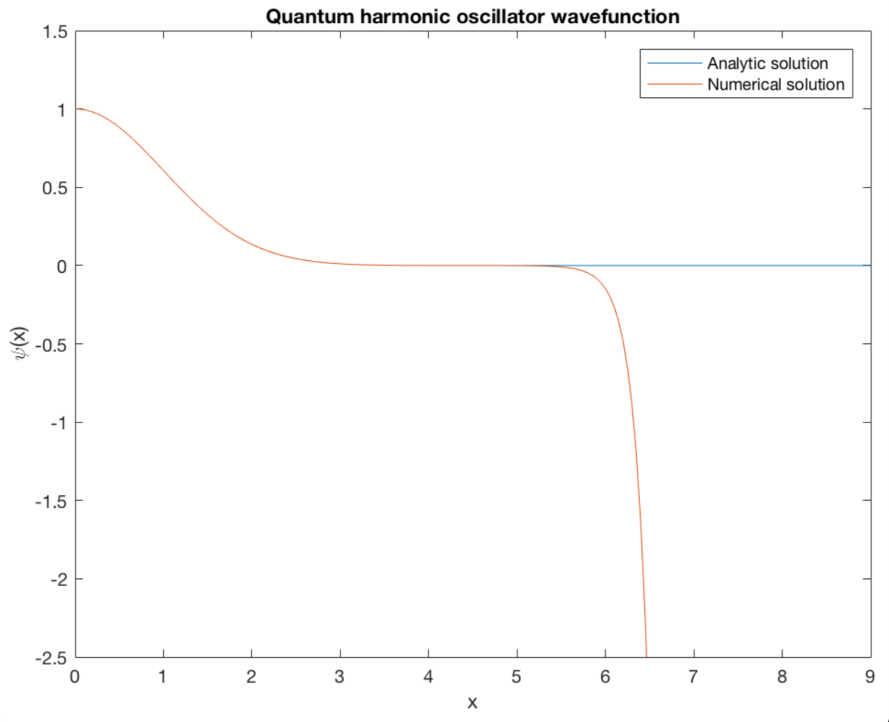
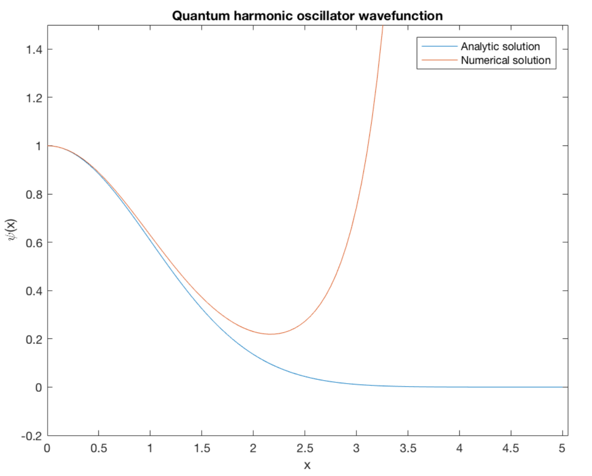

# Solving the Schrodinger equation for a quantum harmonic oscillator in 1D.

Ground state wavefunction of the quantum harmonic oscillator: comparing the numerical solution using solve_num.m to the 
analytical one, with the exact ground state energy (left figure) and inixact energy (E=0.95 in units of ℏ). Using eigenvalue.m 
and an approximated energy an input one can get an improved eigenvalue.

 

